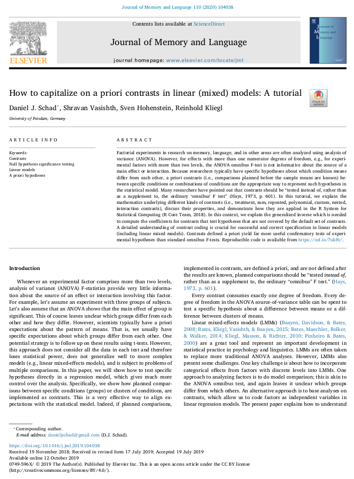

```{r setup, include=FALSE}
knitr::opts_chunk$set(echo = TRUE)
```

# Overview 

In this second workshop on mixed models we will look at how to build LMMs for factorial design, including ensuring we choose a contrast coding scheme for our experimental factors that allows us to interpret our parameter estimates appropriately. We'll also look at generalised linear mixed models (GLMMs) in the context of modelling binomial data (where our DV is a 0 or a 1), and ordinal mixed models for cases where our DV is measured on an ordinal scale (as might be the case with Likert-scale data).

&nbsp;&nbsp;

[video 1 here]

&nbsp;&nbsp;

## Slides

You can download the slides in .odp format by clicking [here](../slides/Mixed_Models_Part_2.odp) and in .pdf format by clicking on the image below. 

&nbsp;&nbsp;

<center>

[{width=75%}](../slides/Mixed_Models_Part_2.pdf)

</center>

&nbsp;&nbsp;

Once you've watched the video above, run the code below on your own machines.

## Mixed Models
### 2 x 2 Factorial Design

In this first case imagine that we have a 2 x 2 repeated measures design. The first factor is Context (Negative vs. Positive) and the second is Sentence Type (Negative vs. Positive). The DV is reading time duration to a Target Sentence (measured in ms.). We have 60 subjects, and 28 items.

Let's first load the libraries that we're going to use.

```{r, message=FALSE}
library(tidyverse)
library(lme4)
library(lmerTest)
library(emmeans)
library(performance)
```

Now we're going to read in our data and turn our `subject`, `item`, `context`, and `sentence` columns into factors.

```{r, message=FALSE}
factorial_data <- read_csv("https://raw.githubusercontent.com/ajstewartlang/15_mixed_models_pt1/master/data/2x2.csv")

tidied_factorial_data <- factorial_data %>%
  mutate(subject = factor(Subject), item = factor(Item), RT = RT,
            context = factor(Context), sentence = factor(Sentence))
```

When we generate summary statistics, we encounter the issues of NAs where we expected to see mean values. 

```{r}
tidied_factorial_data %>%
  group_by(context, sentence) %>%
  summarise(mean_rt = mean(RT), sd_rt = sd(RT))
```

This indicates we likely have missing data. R never decides what it should do about missing data - you need to make that decision. Let's use the {visdat} package to investigate...

```{r}
library(visdat)
```

```{r}
vis_miss(tidied_factorial_data)
```

We can calculate how much data RT is missing another way... 

```{r}
tidied_factorial_data %>%
  filter(is.na(RT)) %>%
  count()
```

So we can see we have 12 missing data points. We can filter our cases where we have missing data and re-do our summary statistics.

```{r}
tidied_factorial_data %>%
  filter(!is.na(RT)) %>%
  group_by(context, sentence) %>%
  summarise(mean_rt = mean(RT), sd_rt = sd(RT))
```

Let's visualise the data next. I'm using the `stat_summary()` function to add means and bootstrapped condidence intervals around those means for each of our conditions. I use the syntax `context:sentence` in the `aes()` expression to indicate that I want to plot all combinations of these two factors (i.e., the interactions). I use a few other aesthetic tweaks to make the graph look a little better than the default. I should have added a title - can you modify the code below to do that?

```{r}
tidied_factorial_data %>%
  filter(!is.na(RT)) %>%
  ggplot(aes(x = context:sentence, y = RT, colour = context:sentence)) +
  geom_violin() +
  geom_jitter(width = .1, alpha = .2) +
  stat_summary(fun.data = "mean_cl_boot", colour = "black") +
  guides(colour = FALSE) +
  labs(x = "Context X Sentence",
       y = "RT (ms.)") +
  theme_minimal() +
  coord_flip()
```

Before we build our model, we need to set the contrast coding for our factors. By default, R using dummy (treatment) coding (think back to how we used this in the context of understanding ANOVA as a case of regression). The problem with dummy coding for factorial designs is that you can end up misinterpreting simple effects (e.g., an effect of Factor 2 at one level of Factor 1) as a main effect (e.g., an effect of Factor 2 at the average of Factor 1). To address this, we can use sum or deviation coding. This will result in the Intercept of our model correspoding to the grand mean of our conditions (i.e., the mean of means) and makes the interpretation of our fixed effects (and any interaction effects) more straightforward. 

If you're interested in reading more about this topic, I recommend this great paper by Schad and colleagues. Just click on the image below to be access it.

<center>

[{width=75%}](https://www.sciencedirect.com/science/article/pii/S0749596X19300695)

</center>

Let's set the contrast coding of our factors using deviation coding as follows. This will allow us to compare each of our conditions to the average of the other conditions.

```{r}
contrasts(tidied_factorial_data$context) <- matrix(c(.5, -.5))
contrasts(tidied_factorial_data$sentence) <- matrix(c(.5, -.5))
```

Now that our contrasts are coded we can go ahead and build our mixed model. Note that the maximal model did not converge so we dropped the interaction term (`context:sentence`) from our subject random effect. For this random effect, we are modelling just additive effects of `context` and `sentence`.

```{r}
factorial_model <- lmer(RT ~ context * sentence + 
                          (1 + context + sentence | subject) +
                          (1 + context * sentence | item), 
                        data = tidied_factorial_data)
```

Let's check the assumptions of our model.

```{r}
check_model(factorial_model)
```

So it looks like we may have an issue with the normality of our residuals. Things looks ok apart from the right 20% of our residuals. We may want to try to model under a different distribution. We can plot our RT values on a Cullen and Frey plot.

```{r, warning=FALSE}
library(fitdistrplus)
```

```{r}
missing_data_removed <- tidied_factorial_data %>%
  filter(!is.na(RT))
  
descdist(missing_data_removed$RT)
```

On the Cullen and Frey plot we see our data is quite close to a Gamma distribution. We can try to model our data using a generalised linear model assuming sampling from the Gamma distribution as follows. One of the challenges with such models is that very often the random effects structure needs to be radically simplified. This can increase the Type I error rate and may result in us thinking we have an effect when really we don't. This is one of the challenges of building models in general. To paraphrase George Box, all models are wrong but some are useful. Let's try to build a Gamma model anyway. 

```{r}
gamma_factorial_model <- glmer(RT ~ context * sentence + 
                          (1 + context + sentence | subject) +
                          (1 + context + sentence | item), 
                          family = Gamma,
                          nAGQ = 0,
                          data = tidied_factorial_data)
```

In order to fit this model, I had to se nAGQ to 0 (its default is 1). This means our parameter estimates are a little less exact than if we had gone with the default (but at least the model converges on a solution). 

Let's look at the summaries of our two models and see if they differ. First we'll look at our `factorial_model` which we built using `lmer()`.

```{r}
summary(factorial_model)
```
So we have a main effect of `Context` and an interaction between `Context` and `Sentence`.

What about our Gamma model built using `glmer()`?

```{r}
summary(gamma_factorial_model)
```

OK, this is good. The same story emerges - a main effect of `Context` and an interaction between `Context` and `Sentence`. Note that the *p*-values are a lot lower here as our random effects terms didn't include any random slopes. 

# Your Challenge


## Improve this Workshop

If you spot any issues/errors in this workshop, you can raise an issue or create a pull request for [this repo](https://github.com/ajstewartlang/15_mixed_models_pt1). 