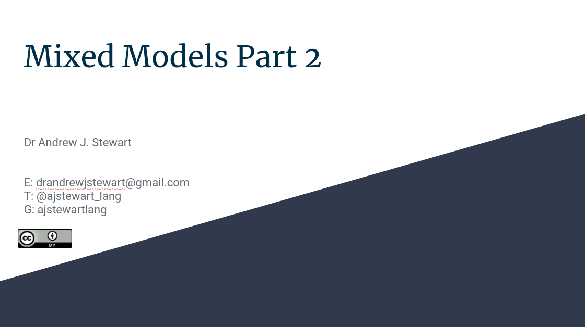

```{r setup, include=FALSE}
knitr::opts_chunk$set(echo = TRUE)
```

# Overview 

In this second workshop on mixed models we will look at how to build LMMs for factorial design, including ensuring we choose a contrast coding scheme for our experimental factors that allows us to interpret our parameter estimates appropriately. We'll also look at generalised linear mixed models (GLMMs) in the context of modelling binomial data (where our DV is a 0 or a 1), and ordinal mixed models for cases where our DV is measured on an ordinal scale (as might be the case with Likert-scale data).

&nbsp;&nbsp;

[video 1 here]

&nbsp;&nbsp;

## Slides

You can download the slides in .odp format by clicking [here](../slides/Mixed_Models_Part_2.odp) and in .pdf format by clicking on the image below. 

&nbsp;&nbsp;

<center>

[{width=75%}](../slides/Mixed_Models_Part_2.pdf)

</center>

&nbsp;&nbsp;

Once you've watched the video above, run the code below on your own machines.

# Your Challenge


## Improve this Workshop

If you spot any issues/errors in this workshop, you can raise an issue or create a pull request for [this repo](https://github.com/ajstewartlang/15_mixed_models_pt1). 